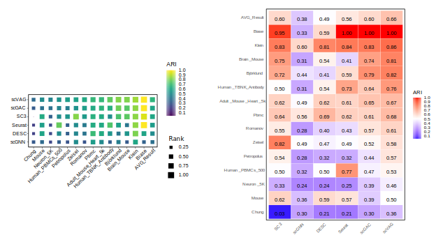
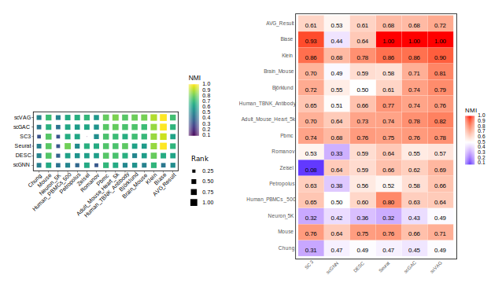

# scVAG: Unified Single-Cell Clustering via Variational-Autoencoder Integration with Graph Attention Autoencoder

<p style="text-align: justify;">
scVAG is an innovative framework that integrates Variational Autoencoder (VAE) and Graph Attention Autoencoder (GATE) models for enhanced analysis of single-cell gene expression data. Built upon the scGAC architecture, scVAG replaces linear PCA with nonlinear dimensionality reduction to improve clustering performance. Through comparative evaluation on 14 datasets, scVAG demonstrates greater robustness and clustering precision compared to previous state-of-the-art methods. 
</p>

## Table of Contents
- [Installation](#installation)
- [Dependencies](#dependencies)
- [Datasets](#datasets)
- [Usage](#usage)
- [Results](#results)  
- [Features](#features)
- [Contributing](#contributing)
- [License](#license)
- [Acknowledgments](#acknowledgments)


## Installation

To get started with scVAG, you can clone the repository using the following command:

```bash
git clone https://github.com/pourialaghayee/scVAG.git
```
<p style="text-align: justify;">
This will create a local copy of the project on your machine. Make sure you have Git installed before running the command.
</p>

<p style="text-align: justify;">
After cloning, you can navigate to the project directory and follow any additional setup or installation instructions provided in the project's documentation.
</p>

## Dependencies

Make sure you have the following packages installed:

- [Python](https://www.python.org/) - Version 3.6.4
- [Torch](https://pytorch.org/) - Version 1.10.1
- [Tensorflow](https://www.tensorflow.org/) - Version 1.12.0
- [Keras](https://keras.io/) - Version 2.1.0
- [Numpy](https://numpy.org/) - Version 1.19.5
- [Scipy](https://www.scipy.org/) - Version 1.5.4
- [Pandas](https://pandas.pydata.org/) - Version 1.1.5
- [Scikit-learn (Sklearn)](https://scikit-learn.org/) - Version 0.24.2

## Datasets
<p style="text-align: justify;">
The scVAG project utilizes several datasets for experimentation and testing. You can download the original datasets from the following links:
</p>

- **Biase Dataset:**
  - [Link to Biase Dataset](https://www.ncbi.nlm.nih.gov/geo/query/acc.cgi?acc=GSE57249)

- **Klein Dataset:**
  - [Link to Klein Dataset](https://www.ncbi.nlm.nih.gov/geo/query/acc.cgi?acc=GSE65525)

- **Romanov Dataset:**
  - [Link to Romanov Dataset](https://www.ncbi.nlm.nih.gov/geo/query/acc.cgi?acc=GSE74672)

- **Zeisel Dataset:**
  - [Link to Zeisel Dataset](https://www.ncbi.nlm.nih.gov/geo/query/acc.cgi?acc=GSE60361)

- **Chung Dataset:**
  - [Link to Chung Dataset](https://www.ncbi.nlm.nih.gov/geo/query/acc.cgi?acc=GSE75688)

- **PBMC Dataset:**
  - [Link to PBMC Dataset](https://support.10xgenomics.com/single-cell-gene-expression/datasets/2.1.0/pbmc4k)

- **Neuron_5k Dataset:**
  - [Link to Neuron_5k Dataset](https://cf.10xgenomics.com/samples/cell-exp/6.0.0/SC3_v3_NextGem_DI_Neurons_5K_SC3_v3_NextGem_DI_Neurons_5K/SC3_v3_NextGem_DI_Neurons_5K_SC3_v3_NextGem_DI_Neurons_5K_web_summary.html)

- **Mouse Dataset:**
  - [Link to Mouse Dataset](https://figshare.com/s/865e694ad06d5857db4b)

- **Petropoulos Dataset:**
  - [Link to Petropoulos Dataset](https://www.ebi.ac.uk/biostudies/arrayexpress/studies/E-MTAB-3929)

- **Mouse_Brain Dataset:**
  - [Link to Mouse_Brain Dataset](https://www.10xgenomics.com/resources/datasets/mouse-tissue-microarray-in-3x3-layout-with-2-mm-edge-to-edge-spacing-ffpe-2-standard)

- **Bjorklund Dataset:**
  - [Link to Bjorklund Dataset](https://www.ncbi.nlm.nih.gov/geo/query/acc.cgi?acc=GSE70580)

- **Human_TBNK_Antibody Dataset:**
  - [Link to Human_TBNK_Antibody Dataset](https://www.10xgenomics.com/resources/datasets/1-k-human-pbm-cs-with-total-seq-b-human-tbnk-antibody-cocktail-3-lt-v-3-1-3-1-low-6-0-0)

- **Adult_Mouse_Heart_5k Dataset:**
  - [Link to Adult_Mouse_Heart_5k Dataset](https://www.10xgenomics.com/resources/datasets/5k-adult-mouse-heart-nuclei-isolated-with-chromium-nuclei-isolation-kit-3-1-standard)

- **Human_PBMCs_500 Dataset:**
  - [Link to Human_PBMCs_500 Dataset](https://www.10xgenomics.com/resources/datasets/500-human-pbm-cs-3-lt-v-3-1-chromium-x-3-1-low-6-1-0)

Please refer to the respective dataset links for more details about each dataset and its usage in the scVAG project.

## Usage

### Preprocessing
<p style="text-align: justify;">

When using the `preprocess.py` script for data preprocessing, it is crucial to specify the address of your dataset. The dataset file must be named `ori_data.tsv` for the preprocessing script to function correctly. Below is an example command illustrating how to execute the preprocessing script:
<p>

```bash
python preprocess.py Chung
```
After preprocessing, a file named `data.tsv` is generated to store the processed data. This file serves as input for both the Variational Autoencoder (VAE) and the graph construction stages in the scVAG pipeline.

### Run VAE

For VAE to work, you must specify the address of the dataset. for example,

```bash
python scVAG_VAE.py Chung
```
The `vae.csv` file is stored within the dataset folder, capturing the intermediate output from the initial VAE encoding phase. This file stores the latent representation extracted by the Variational Autoencoder, crucial for subsequent stages.

### Run GATE (scGAC)
<p style="text-align: justify;">
As our scVAG pipeline builds upon the scGAC framework, we adopt their open-sourced codebase for executing the graph attention autoencoder and network enhancement phases. This enables direct benchmarking against the baseline architecture while allowing us to focus enhancements on the novel VAE integration and evaluation. Specifically, the GATE and NE modules are configured using the original scGAC parameters of input dataset address and number of clusters. By reusing optimized scaffolding code, we can directly validate improvements arising from our VAE augmentation and comparative analysis.
<p>

For GATE section to work, you must specify the address of the dataset and the number of clusters. for example,

```bash
python scGAC.py Chung 5
```
The /results folder contains text files with the predicted clustering outputs for each dataset. The files follow the naming convention pred_<dataset_name>.txt - for example, the predicted clusters for the mouse_brain dataset are in pred_mouse_brain.txt. These files allow examination of the specific cluster assignments predicted by the model across different datasets.

## Results
### Clustering Performance

We evaluated the performance of the scVAG model on a diverse set of single-cell datasets, ranging from humans to mice. The clustering accuracy was assessed using two widely recognized metrics: Adjusted Rand Index (ARI) and Normalized Mutual Information (NMI).


#### ARI Comparison

Figure 1 illustrates the ARI comparison between scVAG and five other single-cell clustering baselines across 14 datasets. Each subplot represents a specific dataset, while the last subplot presents the average ARI across all datasets.


*Figure 1: This is a sample image.*

##### Observations

- scVAG consistently outperformed other baselines in 10 out of 14 datasets.
- The average ARI across all datasets demonstrates the superior clustering accuracy achieved by scVAG.

#### NMI Comparison

Figure 2 provides a similar comparison as in Figure 1, but using the Normalized Mutual Information (NMI) metric.


*Figure 2: This is a sample image.*

##### Insights

- scVAG consistently exhibits higher NMI values across various datasets.
- The average NMI reinforces scVAG's effectiveness in capturing meaningful clusters.

### Dataset-Specific Analysis

Table 1 and Table2 summarizes detailed ARI and NMI scores respectively, for scVAG and baseline methods on each individual dataset, providing a nuanced understanding of scVAG's strengths across different biological contexts.

<p align="center">
  <b>ARI Scores</b><br>
</p>

<p align="center">

| Dataset               |scVAG|SC3|scGAC|scGNN|Seurat|DESC|
|-----------------------|-------------|-----------|-------------|-------------|--------------|------------|
| **Klein**             | 0.863       | 0.831     | 0.835       | 0.601       | 0.836        | 0.808      |
| **Romanov**           | 0.612       | 0.551     | 0.569       | 0.283       | 0.426        | 0.403      |
| **Chung**             | 0.365       | 0.025     | 0.303       | 0.298       | 0.209        | 0.215      |
| **Pbmc**              | 0.676       | 0.643     | 0.613       | 0.562       | 0.623        | 0.687      |
| **Björklund**         | 0.82        | 0.721     | 0.785       | 0.438       | 0.587        | 0.412      |
| **Mouse**             | 0.499       | 0.616     | 0.393       | 0.362       | 0.571        | 0.593      |
| **Zeisel**            | 0.578       | 0.822     | 0.52        | 0.495       | 0.494        | 0.473      |
| **Petropolus**        | 0.567       | 0.538     | 0.439       | 0.282       | 0.322        | 0.318      |
| **Brain_Mouse**       | 0.814       | 0.754     | 0.744       | 0.306       | 0.41         | 0.535      |
| **Neuron_5K**         | 0.463       | 0.327     | 0.385       | 0.236       | 0.249        | 0.239      |
| **Biase**             | 1           | 0.948     | 1           | 0.33        | 1            | 0.594      |
| **Adult_Mouse_Heart_5k** | 0.674   | 0.616     | 0.654       | 0.489       | 0.609        | 0.621      |
| **Human_TBNK_Antibody**  | 0.763 | 0.502     | 0.637       | 0.314       | 0.733        | 0.535      |
| **Human_PBMCs_500**      | 0.525 | 0.496     | 0.47        | 0.317       | 0.772        | 0.496      |
| **Average**           | 0.659       | 0.599     | 0.596       | 0.38        | 0.56         | 0.495      |

</p>

---

<p align="center">
  <b>NMI Scores</b><br>
</p>

<p align="center">

| Dataset             |scVAG|SC3|scGAC|scGNN|Seurat|DESC|
|-----------------------|-------------|-----------|-------------|-------------|--------------|------------|
| **Klein**             | 0.895       | 0.859     | 0.856       | 0.68        | 0.856        | 0.784      |
| **Romanov**           | 0.567       | 0.53      | 0.553       | 0.33        | 0.641        | 0.589      |
| **Chung**             | 0.494       | 0.31      | 0.446       | 0.469       | 0.47         | 0.493      |
| **Pbmc**              | 0.78        | 0.737     | 0.76        | 0.683       | 0.746        | 0.757      |
| **Björklund**         | 0.794       | 0.718     | 0.742       | 0.547       | 0.61         | 0.5        |
| **Mouse**             | 0.708       | 0.757     | 0.664       | 0.635       | 0.762        | 0.752      |
| **Zeisel**            | 0.686       | 0.076     | 0.624       | 0.635       | 0.661        | 0.593      |
| **Petropolus**        | 0.655       | 0.627     | 0.583       | 0.384       | 0.523        | 0.555      |
| **Brain_Mouse**       | 0.809       | 0.696     | 0.708       | 0.486       | 0.579        | 0.588      |
| **Neuron_5K**         | 0.49        | 0.315     | 0.427       | 0.425       | 0.324        | 0.364      |
| **Biase**             | 1           | 0.929     | 1           | 0.443       | 1            | 0.641      |
| **Adult_Mouse_Heart_5k** | 0.819   | 0.705     | 0.783       | 0.636       | 0.738        | 0.734      |
| **Human_TBNK_Antibody**  | 0.759 | 0.649     | 0.736       | 0.508       | 0.769        | 0.658      |
</p>

##### Key Findings

- scVAG consistently excels in specific datasets, showcasing adaptability to diverse biological scenarios.

### Robustness Analysis

To assess the robustness of the scVAG model, we employed two visualization approaches. Figure 3 Figure 4 depicts a dot plot, where the size and brightness of each point correspond to the ARI and NMI values, demonstrating scVAG's robust performance across different datasets.


<p align="center">
  
  <br>
  <em>Figure 3: This is a sample image.</em>
</p>


<p align="center">
  
  <br>
  <em>Figure 4: This is a sample image.</em>
</p>

##### Notable Features

- scVAG exhibits robust clustering performance across datasets, as indicated by the dot plot.

### Interpretability

Figure 5 provides t-SNE clustering plots for two representative datasets (Human_TBNK_Antibody and Chung), highlighting scVAG's interpretability and its ability to align with true labels.


*Figure 5: This is a sample image.*


##### Interpretation

- scVAG-generated clusters align closely with true labels, demonstrating its interpretability in capturing underlying biological structures.

## Conclusion

The comprehensive evaluation of scVAG's clustering performance, dataset-specific analysis, robustness, and interpretability demonstrates its efficacy in single-cell data analysis. The model consistently outperforms baseline methods, offering a unified and adaptable approach to single-cell clustering.

## Features

- **Combines Strengths:**
  - Combines strengths of Variational Autoencoders (VAEs) and graph neural networks to leverage their respective advantages.

- **Robust Latent Space Encoding:**
  - Enables robust latent space encoding specifically tuned for single-cell data, enhancing the representation of complex biological structures.

- **State-of-the-Art Clustering:**
  - Achieves state-of-the-art clustering accuracy across diverse datasets, showcasing the effectiveness of the proposed approach.

- **Generalizable Approach:**
  - Generalizable approach applicable to a variety of single-cell experiments, providing flexibility and utility across different biological contexts.


## Contributing
Explain how others can contribute to your project.

## License

MIT License

Copyright (c) 2023 pouria_laghaee
<p style="text-align: justify;">
Permission is hereby granted, free of charge, to any person obtaining a copy
of this software and associated documentation files (the "Software"), to deal
in the Software without restriction, including without limitation the rights
to use, copy, modify, merge, publish, distribute, sublicense, and/or sell
copies of the Software, and to permit persons to whom the Software is
furnished to do so, subject to the following conditions:
<p>

**We acknowledge that portions of this code are derived from the scGAC project, and we express our gratitude to the scGAC authors for their contributions.**

<p style="text-align: justify;">
THE SOFTWARE IS PROVIDED "AS IS," WITHOUT WARRANTY OF ANY KIND, EXPRESS OR
IMPLIED, INCLUDING BUT NOT LIMITED TO THE WARRANTIES OF MERCHANTABILITY,
FITNESS FOR A PARTICULAR PURPOSE, AND NONINFRINGEMENT. IN NO EVENT SHALL THE
AUTHORS OR COPYRIGHT HOLDERS BE LIABLE FOR ANY CLAIM, DAMAGES, OR OTHER
LIABILITY, WHETHER IN AN ACTION OF CONTRACT, TORT, OR OTHERWISE, ARISING FROM,
OUT OF, OR IN CONNECTION WITH THE SOFTWARE OR THE USE OR OTHER DEALINGS IN THE
SOFTWARE.
<p>


## Acknowledgments
Give credit to any resources, libraries, or individuals you want to acknowledge.

