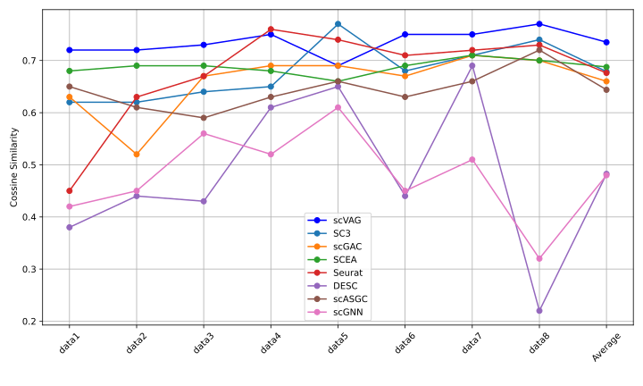
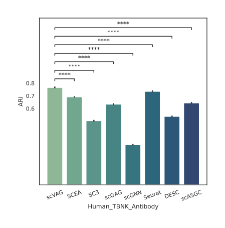

# scVAG: Unified Single-Cell Clustering via Variational-Autoencoder Integration with Graph Attention Autoencoder

<p style="text-align: justify;">
scVAG is an innovative framework that integrates Variational Autoencoder (VAE) and Graph Attention Autoencoder (GATE) models for enhanced analysis of single-cell gene expression data. Built upon the scGAC architecture, scVAG replaces linear PCA with nonlinear dimensionality reduction to improve clustering performance. Through comparative evaluation on 19 real and synthetic datasets, scVAG demonstrates greater robustness and clustering precision compared to previous state-of-the-art methods. We also tested the significance of the results using T-test across all datasets.
</p>

## Table of Contents
- [Installation](#installation)
- [Dependencies](#dependencies)
- [Datasets](#datasets)
- [Usage](#usage)
- [Results](#results)  
- [Features](#features)
- [Contributing](#contributing)
- [License](#license)
- [Acknowledgments](#acknowledgments)


## Installation

To get started with scVAG, you can clone the repository using the following command:

```bash
git clone https://github.com/pourialaghayee/scVAG.git
```
<p style="text-align: justify;">
This will create a local copy of the project on your machine. Make sure you have Git installed before running the command.
</p>

<p style="text-align: justify;">
After cloning, you can navigate to the project directory and follow any additional setup or installation instructions provided in the project's documentation.
</p>

## Dependencies

Make sure you have the following packages installed:

- [Python](https://www.python.org/) - Version 3.6.4
- [Torch](https://pytorch.org/) - Version 1.10.1
- [Tensorflow](https://www.tensorflow.org/) - Version 1.12.0
- [Keras](https://keras.io/) - Version 2.1.0
- [Numpy](https://numpy.org/) - Version 1.19.5
- [Scipy](https://www.scipy.org/) - Version 1.5.4
- [Pandas](https://pandas.pydata.org/) - Version 1.1.5
- [Scikit-learn (Sklearn)](https://scikit-learn.org/) - Version 0.24.2

## Datasets
<p style="text-align: justify;">
The scVAG project utilizes several datasets for experimentation and testing. You can download the original datasets from the following links:
</p>

- **Biase Dataset:**
  - [Link to Biase Dataset](https://www.ncbi.nlm.nih.gov/geo/query/acc.cgi?acc=GSE57249)

- **Klein Dataset:**
  - [Link to Klein Dataset](https://www.ncbi.nlm.nih.gov/geo/query/acc.cgi?acc=GSE65525)

- **Romanov Dataset:**
  - [Link to Romanov Dataset](https://www.ncbi.nlm.nih.gov/geo/query/acc.cgi?acc=GSE74672)

- **Chung Dataset:**
  - [Link to Chung Dataset](https://www.ncbi.nlm.nih.gov/geo/query/acc.cgi?acc=GSE75688)

- **PBMC Dataset:**
  - [Link to PBMC Dataset](https://support.10xgenomics.com/single-cell-gene-expression/datasets/2.1.0/pbmc4k)

- **Neuron_5k Dataset:**
  - [Link to Neuron_5k Dataset](https://cf.10xgenomics.com/samples/cell-exp/6.0.0/SC3_v3_NextGem_DI_Neurons_5K_SC3_v3_NextGem_DI_Neurons_5K/SC3_v3_NextGem_DI_Neurons_5K_SC3_v3_NextGem_DI_Neurons_5K_web_summary.html)

- **Petropoulos Dataset:**
  - [Link to Petropoulos Dataset](https://www.ebi.ac.uk/biostudies/arrayexpress/studies/E-MTAB-3929)

- **Mouse_Brain Dataset:**
  - [Link to Mouse_Brain Dataset](https://www.10xgenomics.com/resources/datasets/mouse-tissue-microarray-in-3x3-layout-with-2-mm-edge-to-edge-spacing-ffpe-2-standard)

- **Bjorklund Dataset:**
  - [Link to Bjorklund Dataset](https://www.ncbi.nlm.nih.gov/geo/query/acc.cgi?acc=GSE70580)

- **Human_TBNK_Antibody Dataset:**
  - [Link to Human_TBNK_Antibody Dataset](https://www.10xgenomics.com/resources/datasets/1-k-human-pbm-cs-with-total-seq-b-human-tbnk-antibody-cocktail-3-lt-v-3-1-3-1-low-6-0-0)

- **Adult_Mouse_Heart_5k Dataset:**
  - [Link to Adult_Mouse_Heart_5k Dataset](https://www.10xgenomics.com/resources/datasets/5k-adult-mouse-heart-nuclei-isolated-with-chromium-nuclei-isolation-kit-3-1-standard)

Please refer to the respective dataset links for more details about each dataset and its usage in the scVAG project. In addition to the above real datasets, we used the [Splatter](https://bioconductor.org/packages/release/bioc/html/splatter.html) package to generate synthetic single-cell gene expression matrices (varying in cluster number and distribution).
## Usage

### Preprocessing
<p style="text-align: justify;">

When using the `preprocess.py` script for data preprocessing, it is crucial to specify the address of your dataset. The dataset file must be named `ori_data.tsv` for the preprocessing script to function correctly. Below is an example command illustrating how to execute the preprocessing script:
<p>

```bash
python preprocess.py Chung
```
After preprocessing, a file named `data.tsv` is generated to store the processed data. This file serves as input for both the Variational Autoencoder (VAE) and the graph construction stages in the scVAG pipeline.

### Run VAE

For VAE to work, you must specify the address of the dataset. for example,

```bash
python scVAG_VAE.py Chung
```
The `vae.csv` file is stored within the dataset folder, capturing the intermediate output from the initial VAE encoding phase. This file stores the latent representation extracted by the Variational Autoencoder, crucial for subsequent stages.

### Run GATE (scGAC)
<p style="text-align: justify;">
As our scVAG pipeline builds upon the scGAC framework, we adopt their open-sourced codebase for executing the graph attention autoencoder and network enhancement phases. This enables direct benchmarking against the baseline architecture while allowing us to focus enhancements on the novel VAE integration and evaluation. Specifically, the GATE and NE modules are configured using the original scGAC parameters of input dataset address and number of clusters. By reusing optimized scaffolding code, we can directly validate improvements arising from our VAE augmentation and comparative analysis.
<p>

For GATE section to work, you must specify the address of the dataset and the number of clusters. for example,

```bash
python scGAC.py Chung 5
```
The /results folder contains text files with the predicted clustering outputs for each dataset. The files follow the naming convention pred_<dataset_name>.txt - for example, the predicted clusters for the mouse_brain dataset are in pred_mouse_brain.txt. These files allow examination of the specific cluster assignments predicted by the model across different datasets.

## Results
### Clustering Performance

We evaluated the performance of the scVAG model on a diverse set of single-cell datasets, ranging from humans to mice. The clustering accuracy was assessed using two widely recognized metrics: Adjusted Rand Index (ARI) and Normalized Mutual Information (NMI).


#### ARI and NMI Comparison

Figure 1 illustrates the ARI and NMI comparison between scVAG and seven other single-cell clustering baselines across 11  real datasets. Each subplot represents a specific dataset, while the last subplot presents the average ARI across all datasets.

<p align="center">
  
  <br>
  <em>Figure 1: Comparison of Adjusted Rand Index (ARI) scores (A) and Normalized Mutual Information (NMI) scores (B) for scVAG versus baseline methods on 11 single-cell datasets. Each sub-figure displays results for a specific dataset, with the final sub-figures showing the average ARI and NMI across datasets. ScVAG consistently achieves higher ARI and NMI scores compared to other methods across diverse datasets, demonstrating its superior clustering performance in single-cell analysis.</em>
</p>

##### Observations

- scVAG consistently outperformed other baselines in ARI measurment.
- scVAG consistently exhibits higher NMI values across various datasets.
- The average ARI and NMI across all datasets demonstrates the superior clustering accuracy achieved by scVAG.

#### Ablation experiment
The decision to integrate VAE and GATE in scVAG was driven by practical considerations, leveraging their combined strengths for improved performance, as validated by ablation experiments in Figure 3.
<p align="center">
  
  <br>
  <em>Figure 2: Results of the ablation experiment, comparing model performance using VAE, GATE, and their combination (ARI (A) and NMI (B)). Compared to using VAE or GATE alone, the combined approach exhibits superior performance.</em>
</p>

#### Evaluation on Synthetic Datasets
We assessed the noise-handling capability and efficacy of our proposed model across diverse synthetic datasets, showcasing superior performance in challenging conditions, as depicted in Figure 4.
<p align="center">
  
  <br>
  <em>Figure 4: Comparison of Cosine Similarity scores for scVAG across 8 simulated datasets. Overall, scVAG demonstrates effective performance in measuring cell similarity across diverse simulated datasets.</em>
</p>

### Dataset-Specific Analysis

Table 1 and Table2 summarizes detailed ARI and NMI scores respectively, for scVAG and baseline methods on each individual dataset, providing a nuanced understanding of scVAG's strengths across different biological contexts.

<div align="center">
  
  ### Table 1 
  | Dataset                  |scVAG|SCEA|SC3|scGAG|scGNN|Seurat|DESC|scASGC|
  |--------------------------|-----|----|---|-----|-----|------|-----|------|
  | **Klein**                | 0.862| 0.843| 0.832| 0.836| 0.6  | 0.835| 0.803| 0.802|
  | **Romanov**              | 0.618| 0.608| 0.553| 0.567| 0.281| 0.425| 0.403| 0.455|
  | **Chung**                | 0.363| 0.317| 0.025| 0.303| 0.296| 0.206| 0.214| 0.303|
  | **PBMC**                 | 0.676| 0.663| 0.642| 0.613| 0.562| 0.623| 0.686| 0.664|
  | **Björklund**            | 0.821| 0.78 | 0.72 | 0.782| 0.438| 0.585| 0.414| 0.335|
  | **Petropolus**           | 0.565| 0.595| 0.536| 0.437| 0.279| 0.324| 0.315| 0.129|
  | **Brain_Mouse**          | 0.815| 0.785| 0.755| 0.744| 0.307| 0.41 | 0.535| 0.663|
  | **Neuron**               | 0.464| 0.407| 0.328| 0.383| 0.236| 0.247| 0.237| 0.36 |
  | **Biase**                | 1    | 1    | 0.948| 1    | 0.33 | 1    | 0.594| 1    |
  | **Adult_Mouse_Heart_5k** | 0.675| 0.664| 0.616| 0.651| 0.485| 0.609| 0.622| 0.587|
  | **Human_TBNK_Antibody**  | 0.766| 0.692| 0.504| 0.634| 0.316| 0.735| 0.538| 0.644|
  | **AVG_Result**           | 0.693| 0.669| 0.587| 0.632| 0.375| 0.545| 0.487| 0.54 |
</div>

<div align="center">
  
  ### Table 2
  | Dataset                  |scVAG|SCEA|SC3|scGAG|scGNN|Seurat|DESC|scASGC|
  |--------------------------|-----|----|---|-----|-----|------|-----|------|
  | **Klein**                | 0.894| 0.865| 0.857| 0.855| 0.68 | 0.855| 0.785| 0.822|
  | **Romanov**              | 0.566| 0.534| 0.533| 0.555| 0.332| 0.643| 0.588| 0.515|
  | **Chung**                | 0.493| 0.494| 0.319| 0.447| 0.466| 0.471| 0.493| 0.426|
  | **PBMC**                 | 0.779| 0.785| 0.736| 0.761| 0.683| 0.745| 0.756| 0.763|
  | **Björklund**            | 0.794| 0.776| 0.717| 0.741| 0.546| 0.61 | 0.499| 0.459|
  | **Petropolus**           | 0.655| 0.656| 0.626| 0.584| 0.384| 0.525| 0.554| 0.34 |
  | **Brain_Mouse**          | 0.81 | 0.745| 0.697| 0.706| 0.485| 0.579| 0.587| 0.63 |
  | **Neuron**               | 0.49 | 0.461| 0.317| 0.425| 0.425| 0.323| 0.345| 0.606|
  | **Biase**                | 1    | 1    | 0.929| 1    | 0.443| 1    | 0.641| 1    |
  | **Adult_Mouse_Heart_5k** | 0.82 | 0.761| 0.703| 0.781| 0.634| 0.737| 0.734| 0.655|
  | **Human_TBNK_Antibody**  | 0.759| 0.711| 0.651| 0.734| 0.508| 0.77 | 0.661| 0.673|
  | **AVG_Result**           | 0.733| 0.708| 0.644| 0.69 | 0.508| 0.66 | 0.604| 0.626|
</div>
##### Key Findings

- scVAG consistently excels in specific datasets, showcasing adaptability to diverse biological scenarios.

### Robustness Analysis

To assess the robustness of the scVAG model, we employed two visualization approaches. Figure 5 depicts a combined dot plot, where the size and brightness of each point correspond to the ARI and NMI values, demonstrating scVAG's robust performance across different datasets.

<p align="center">
  
  <br>
  <em>Figure 5: Robustness evaluation using the Adjusted Rand Index (ARI) and Normalized Mutual Information (NMI). Panel (A) visually shows scVAG's robust performance across datasets compared to baselines for ARI, with larger, brighter squares indicating higher ARI. Panel (B) quantifies ARI scores, while Panels (C) and (D) represent NMI scores, with scVAG showing consistently bright colors that demonstrate reliable clustering across diverse data. Overall, scVAG exhibits strong resilience and stability, outperforming other methods on average.</em>
</p>

##### Notable Features

- scVAG exhibits robust clustering performance across datasets, as indicated by the dot plot.

### Interpretability

Figure 6 provides t-SNE clustering plots for two representative datasets (Chung and Human_TBNK_Antibody), highlighting scVAG's interpretability and its ability to align with true labels.

<p align="center">
  
  <br>
  <em>Figure 6: t-SNE visualizations comparing scVAG against baseline models on (A) the Chung dataset and (B) the Human_TBNK_Antibody dataset. The 9 subplots in each row display model clustering performance and alignment with true labels. The true labels are included to facilitate comparison. On both datasets, scVAG's clusters show strong agreement with the true cell type labels, accurately capturing intricate patterns in the single-cell data. This demonstrates scVAG's advanced ability for accurate and interpretable clustering of diverse biological datasets compared to current state-of-the-art methods.</em>
</p>

##### Interpretation

- scVAG-generated clusters align closely with true labels, demonstrating its interpretability in capturing underlying biological structures.

### Differential Expression Gene Analysis in Breast Cancer
To showcase the practical utility of our scVAG model, we applied its clustering results to conduct a comprehensive differential expression gene analysis on breast cancer data (GSE75688). Leveraging the DESeq2 package, we identified genes exhibiting significant expression alterations between tumor and healthy conditions. Our findings, summarized in Table 3, underscored several key genes implicated in breast cancer progression and metastasis, such as CALML5, CXADR, ID4, TSPAN8, CLDN4, NDST4, KLK5, and KRT81, with adjusted p-values < 1e-26. 

Table 3: Differentially Expressed Genes Identified by scVAG Clustering Results in Breast Cancer (GSE75688).
| ENS Id          | Gene Symbol | log2FoldChange | p-value | adjusted p-value |
|-----------------|-------------|----------------|---------|------------------|
| ENSG00000178372 | CALML5      | 7.76           | 4.76E-52| 1.19E-48         |
| ENSG00000154639 | CXADR       | 5.06           | 2.29E-41| 3.82E-38         |
| ENSG00000138653 | NDST4       | 9.47           | 1.33E-33| 1.43E-30         |
| ENSG00000167754 | KLK5        | 11.20          | 1.77E-32| 1.78E-29         |
| ENSG00000205426 | KRT81       | 7.75           | 1.63E-31| 1.54E-28         |
| ENSG00000172201 | ID4         | 5.97           | 3.80E-31| 3.17E-28         |
| ENSG00000127324 | TSPAN8      | 7.31           | 1.57E-29| 1.12E-26         |
| ENSG00000189143 | CLDN4       | 2.97           | 9.91E-29| 6.20E-26         |

These findings shed light on the molecular mechanisms underlying breast cancer pathogenesis, further validating the robustness and significance of our scVAG model in unraveling intricate disease processes.

### T-Test Analysis

To validate the statistical significance of the performance improvements achieved by scVAG compared to state-of-the-art methods, we conducted rigorous t-tests on our experimental results. The null hypothesis posited that scVAG does not yield an average improvement in the evaluation criteria over the other methods. Figure 7 visually encapsulates one of the outcomes of these analyses, for scVAG, SCEA, SC3, scGAC, scGNN, Seuart, DESC, and scASGC. The p-values corresponding to the comparison between scVAG and other methods for these metrics are depicted on the plot, with stars denoting different significance levels.

<p align="center">
  
  <br>
  <em>Figure 7: T-test result for all models including our model (scVAG) across all the real datasets. For instance, in the ARI subplot for the Adult_Mouse_Heart_5k dataset (first row, first column), statistical tests revealed that scVAG surpassed the performance of all other methods (SCEA, SC3, scGAC, scGNN, DESC, Seuart, and scASGC) with over 99% significance. Across all test cases, our analyses consistently demonstrated statistical significance, with over 90% of the situations yielding significant results.</em>
</p>

These findings underscore the robustness and reliability of scVAG in outperforming existing methods across diverse datasets, providing compelling evidence of its superior clustering performance.

## Conclusion

The comprehensive evaluation of scVAG's clustering performance, dataset-specific analysis, robustness, and interpretability demonstrates its efficacy in single-cell data analysis. The model consistently outperforms baseline methods, offering a unified and adaptable approach to single-cell clustering.

## Features

- **Combines Strengths:**
  - Combines strengths of Variational Autoencoders (VAEs) and graph neural networks to leverage their respective advantages.

- **Robust Latent Space Encoding:**
  - Enables robust latent space encoding specifically tuned for single-cell data, enhancing the representation of complex biological structures.

- **State-of-the-Art Clustering:**
  - Achieves state-of-the-art clustering accuracy across diverse datasets, showcasing the effectiveness of the proposed approach.

- **Generalizable Approach:**
  - Generalizable approach applicable to a variety of single-cell experiments, providing flexibility and utility across different biological contexts.


## Contributing
- [Seyedpouria Laghaee](https://github.com/pourialaghayee)
- [Morteza Eskandarian](https://github.com/morteza-eskandarian)

## License

MIT License

Copyright (c) 2023 pouria_laghaee
<p style="text-align: justify;">
Permission is hereby granted, free of charge, to any person obtaining a copy
of this software and associated documentation files (the "Software"), to deal
in the Software without restriction, including without limitation the rights
to use, copy, modify, merge, publish, distribute, sublicense, and/or sell
copies of the Software, and to permit persons to whom the Software is
furnished to do so, subject to the following conditions:
<p>

**The above copyright notice and this permission notice shall be included in all
copies or substantial portions of the Software.**

## Acknowledgments
**We acknowledge that portions of this code are derived from the scGAC project, and we express our gratitude to the scGAC authors for their contributions.**


[](https://doi.org/10.5281/zenodo.10464505)

